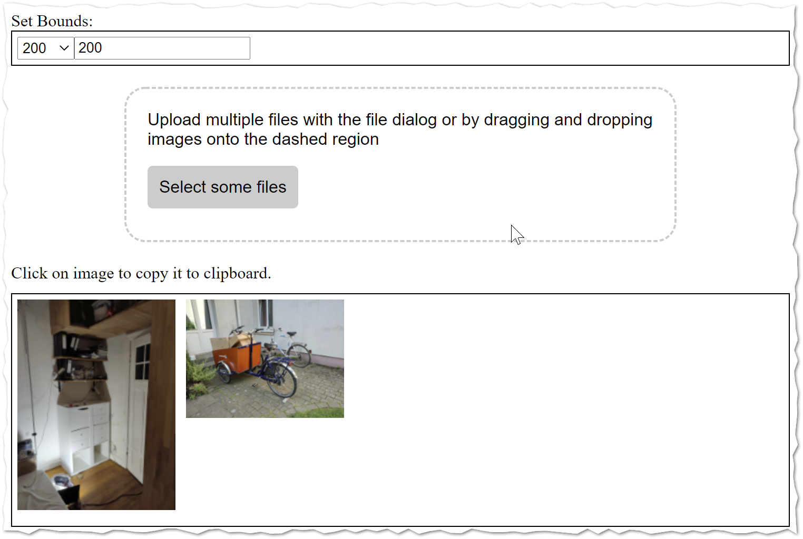

# Browser resize

- Simple HQ image scaler, browser based.
- Choose the max-bounds,
- Drop some images.
- Click on preview to copy the scaled image to clipboard.

Not my best work ever - but it works!

# run it

put index.html, app.css and app.js in some kind of webserver als execute it.

or 

- Install node.js
- clone this project from github (or download it)
- go into directory and run
  
      npm run develop

# Thanks for code and inspiration

- https://www.smashingmagazine.com/2018/01/drag-drop-file-uploader-vanilla-js/
  - Drop Down stuff

- https://imagekit.io/blog/how-to-resize-image-in-javascript/
  - Resize image in Browser
  
- https://stackoverflow.com/a/40547470
  - Copy to Clipboard
  
- https://stackoverflow.com/a/39637827
  - HQ downscale
